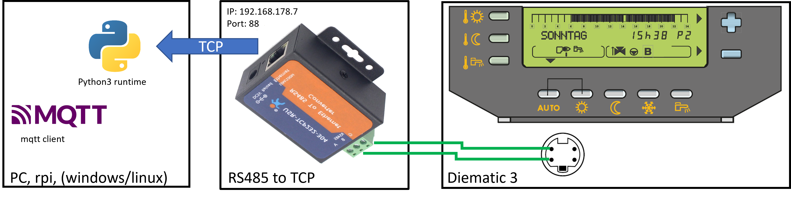

# Interface to Diematic 3 heating controler via modbus to tcp
Interface Software written in python to monitor and control the diematic 3 heating control system.
Based on the aproach from [Benoit](https://github.com/Benoit3/Diematic_to_MQTT) but with a different approach to switch between master and slave in the modbus communication which is independent from clocks and time drift.

# Architecture and Comunication Approach


The sepcial thing about the diematic 3 controler is that it periodically switch between master and slave mode for the communication. It uses a modbus speification.

The basic idea is that the diematic-interface reads the bytes with a timeout of 0.7 seconds. Every time if the exception 'timeout' occure during reading the diematic 3 heating controler is acting as slave.

So there is no need to take care about timing and synchronization. The diematic 3 site controls the timing. Every time it switchs to "slave" -- "stop sending request" a timeout exception occures on the interface site and then it self sends requests.

# Installation
## Manual Testing
change the values in the main source file:
- ip address and port of the RS485 to tcp server [here](https://github.com/aschiffler/diematic/blob/3ebe4380d6d637f653d2688797195f7d7c3e0c78/diematicinterface/diematicinterface.py#L356)  (eg. IP: 192.168.178.7 Port: 88)
- ip address and port of the mqtt broker [here](https://github.com/aschiffler/diematic/blob/3ebe4380d6d637f653d2688797195f7d7c3e0c78/diematicinterface/diematicinterface.py#L350)
)          (eg. IP: 127.0.0.1 port: 1883)
- the root topic of the mqtt publication / subscribtion [here](https://github.com/aschiffler/diematic/blob/3ebe4380d6d637f653d2688797195f7d7c3e0c78/diematicinterface/diematicinterface.py#L358)
```python
cd diematicinterface
python3 diematicinterface.py
```

## As systemd service
create a systemd service and run it
```
[Unit]
Description=mydiematic
Wants=network-online.target signal.service
After=network-online.target signal.service
[Service]
Type=simple
ExecStart=/usr/bin/python3  /PATH/diematicinterface/diematicinterface.py
WorkingDirectory=/PATH/diematicinterface/diematicinterface.py
TimeoutSec=12

Restart=always
[Install]
WantedBy=multi-user.target
```
# Usage
Subcribe to the root mqtt topic you have configured in the source file. (Default: home/heating)

# Adjustments
tbd.
